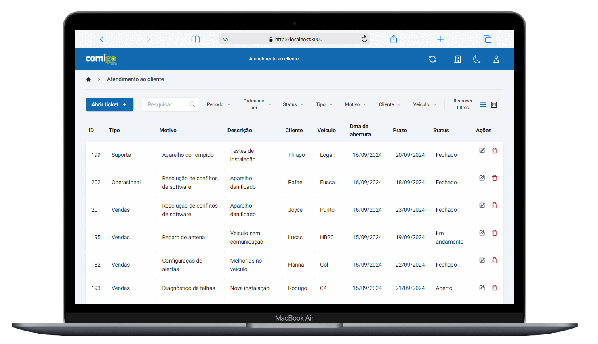

# Desafio Fullstack Comigo

### Link do desafio [aqui](https://github.com/comigotech/avaliacao-candidatos-fullstack)

## Preview 🌐
[](https://avaliacao-candidatos-comigo.vercel.app)

[🔗 Clique aqui para acessar](https://avaliacao-candidatos-comigo.vercel.app)

## Funcionalidades Implementadas
### Back-end:
- [x] Nível 1 - Validação
- [x] Nível 2 - Persistência
- [x] Nível 3 - Autenticação
- [x] Nível 4 - Gerenciamento de permissões
- [ ] Nível 5 - Testes unitários
- [x] Nível 6 - Infraestrutura
- [x] Nível 7 - Cloud AWS (Free tier não aguentou)
- [ ] Nível 8 - Monitoramento e Observabilidade

### Front-end:
- [x] Nível 1 - Cadastro
- [x] Nível 2 - Conexão com API
- [x] Nível 3 - Listagem de dados
- [x] Nível 4 - Autenticação
- [ ] Nível 5 - Testes

---

## Instalação e Execução

Para executar o projeto localmente, siga os passos abaixo:

### Docker

1. Clone o repositório.
```sh
   git clone https://github.com/kennedysmartins/avaliacao-candidatos-comigo.git
```
2. Renomeie o arquivo `.env.example` para `.env` e configure as variáveis de ambiente.
```sh
    mv .env.example .env
```
3. Com o docker instalado, execute  o comando docker para iniciar o banco, backend e frontend.
```sh
   docker-compose up --build -d
```
4. O frontend estará disponível em `http://localhost:3000`, o backend estará disponível em `http://localhost:4000` e o banco de dados estará disponível em `http://localhost:5432`.

### Backend:

1. Clone o repositório.
```sh
   git clone https://github.com/kennedysmartins/avaliacao-candidatos-comigo.git
```
2. Execute o docker-compose up postgres para iniciar o banco ou crie um banco postgres com o nome `comigo` com  as credenciais `postgres` e `admin`.
```sh
   docker-compose up postgres
```
3. Entre na pasta `backend`.
```sh
   cd backend
```
4. Renomeie o arquivo `.env.example` para `.env` e configure as variáveis de ambiente.
```sh
    mv .env.example .env
```
5. Instale as dependências.
```sh
    npm install
```
6. Execute o comando para criar as tabelas no banco de dados.
```sh
    npx prisma migrate dev
```
7. Execute o comando para popular o banco de dados com os dados de exemplo.
```sh
   npm run seed
```
8. Inicie o projeto. O backend estará rodando em `http://localhost:4000`.
```sh
    npm run dev
```


### Frontend:

1. Clone o repositório.
```sh
   git clone https://github.com/kennedysmartins/avaliacao-candidatos-comigo.git
```
2. Entre na pasta `frontend`.
```sh
   cd frontend
```
3. Instale as dependências com `npm install`.
```sh
    npm install
```
4. Renome o arquivo `.env.local.example` para `.env.local` e configure as variáveis de ambiente.
```sh
    mv .env.local.example .env.local
```
5. Inicie o projeto. O front-end estará rodando em `http://localhost:3000`.
```sh
    npm run dev
```
6. Faça login com um dos usuários criados na seed.

#### Logins:

- Utilize os logins `atendente@comigo.com` senha `atendente` e `admin@comigo.com` senha `admin` para acessar o sistema.
---

## Tecnologias Utilizadas
- **Docker** (Back-end)
- **Node.js** (Back-end)
- **TypeScript** (Back-end & Front-end)
- **Postgres** (Back-end)
- **Express.js** (Back-end)
- **Axios** (Front-end)
- **NextJS** (Front-end)
- **Tailwind** (Front-end)
---

## Pendências
- [ ] Monitoramento e Observabilidade (Back-end)
- [ ] Testes (Back-end & Front-end)
- [ ] Finalizar filtros
- [ ] Modo Dark
- [ ] Estilizar tabela para ficar exatamente igual ao design

---
